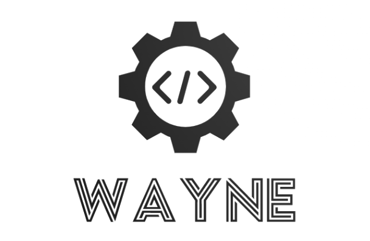

# <a name="readme-top">Starter Page / Navigation Page Based on Native HTML+CSS+JS</a>

   

<!-- PROJECT LOGO -->
 

  
  <h3 align="center">Starter Page / Navigation Page Based on Native HTML+CSS+JS</h3>
  <!-- 

    This project is the Vue frontend of my personal website. -->
    <!--   -->
    <!-- <a href="https://github.com/Wayne-HJ/navweb"><strong>Explore the docs »</strong></a> -->
    <!--   -->
     
    <a href="https://wayne-hj.github.io/navweb/">View Demo</a>
    ·
    <a href="https://github.com/Wayne-HJ/navweb/issues">Report Bug</a>
    <!-- ·
    <a href="https://github.com/Wayne-HJ/navweb/issues">Request Feature</a> -->
  

[Project Description](#project-description) | [Technical Overview](#technical-overview) | [Runtime Environment](#runtime-environment) | [Development Environment](#development-environment) | [Project Screenshots](#project-screenshots) | [Getting Started](#getting-started) | [Chinese(中文)](README_CN.md)

<!-- ABOUT THE PROJECT -->
## Project Description

- Clean code
- Integrated sidebar with commonly used website navigation
- Weather query support
- Customizable quick bookmarks
- Switchable search engines
- Dark mode (system theme)
- Added smart search suggestions
- Icons using Alibaba Iconfont
- GitHub API

## Technical Overview

**Frontend:** HTML + CSS + JavaScript

## Runtime Environment

**Hosting Service:** GitHub Pages | Vercel

## Development Environment

| Development Tool | Description |
|-|-|
| VSCode | Front-end Development IDE |

## Project Screenshots

## Getting Started
Supports deployment on Vercel and GitHub Pages.
Please translate the rest of the README into English.